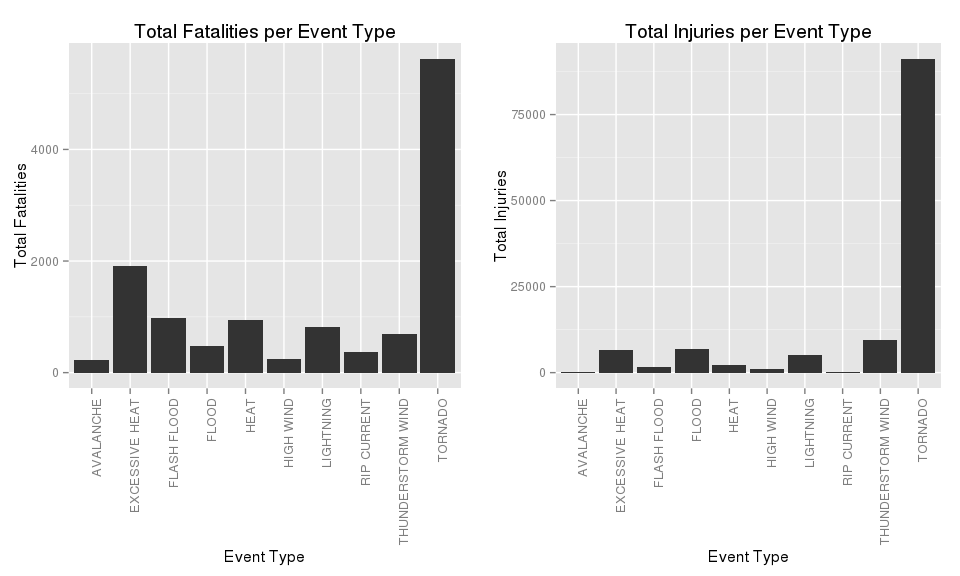
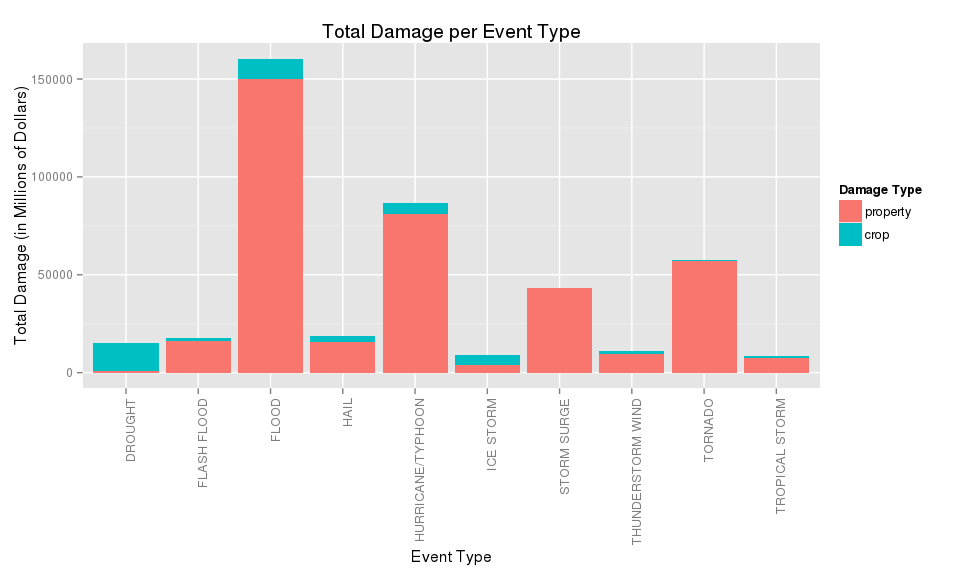

# Harmful historical weather events in the US
Miguel Morales  
December 27, 2015  

On this document, we will be briefly analyzing US weather data. We will be particularly
looking for information about harmful event since 1950 till recent years that have hit the country.

For this, we will be using [Government weather data](https://d396qusza40orc.cloudfront.net/repdata%2Fdata%2FStormData.csv.bz2) freely available.

## Require Packages

There are a couple of packages that we will be using throughout this analysis. Here is the list of them:


```r
require(dplyr)
```

```
## Loading required package: dplyr
## 
## Attaching package: 'dplyr'
## 
## The following objects are masked from 'package:stats':
## 
##     filter, lag
## 
## The following objects are masked from 'package:base':
## 
##     intersect, setdiff, setequal, union
```

```r
require(reshape2)
```

```
## Loading required package: reshape2
```

```r
require(ggplot2)
```

```
## Loading required package: ggplot2
```

```r
require(gridExtra)
```

```
## Loading required package: gridExtra
```

## Data Processing

This dataset presents several issues that we need to deal with it. Since we will working with 'dplyr', we will be converting the data frame into a table data frame object.


```r
df <- read.csv("repdata-data-StormData.csv.bz2")
data <- tbl_df(df)
```

First, lets take a look at the dataset dimensions and column names:


```r
dim(data)
```

```
## [1] 902297     37
```

```r
names(data)
```

```
##  [1] "STATE__"    "BGN_DATE"   "BGN_TIME"   "TIME_ZONE"  "COUNTY"    
##  [6] "COUNTYNAME" "STATE"      "EVTYPE"     "BGN_RANGE"  "BGN_AZI"   
## [11] "BGN_LOCATI" "END_DATE"   "END_TIME"   "COUNTY_END" "COUNTYENDN"
## [16] "END_RANGE"  "END_AZI"    "END_LOCATI" "LENGTH"     "WIDTH"     
## [21] "F"          "MAG"        "FATALITIES" "INJURIES"   "PROPDMG"   
## [26] "PROPDMGEXP" "CROPDMG"    "CROPDMGEXP" "WFO"        "STATEOFFIC"
## [31] "ZONENAMES"  "LATITUDE"   "LONGITUDE"  "LATITUDE_E" "LONGITUDE_"
## [36] "REMARKS"    "REFNUM"
```

Let's have a little deeper look at the data:


```r
summary(data)
```

```
##     STATE__                  BGN_DATE             BGN_TIME     
##  Min.   : 1.0   5/25/2011 0:00:00:  1202   12:00:00 AM: 10163  
##  1st Qu.:19.0   4/27/2011 0:00:00:  1193   06:00:00 PM:  7350  
##  Median :30.0   6/9/2011 0:00:00 :  1030   04:00:00 PM:  7261  
##  Mean   :31.2   5/30/2004 0:00:00:  1016   05:00:00 PM:  6891  
##  3rd Qu.:45.0   4/4/2011 0:00:00 :  1009   12:00:00 PM:  6703  
##  Max.   :95.0   4/2/2006 0:00:00 :   981   03:00:00 PM:  6700  
##                 (Other)          :895866   (Other)    :857229  
##    TIME_ZONE          COUNTY           COUNTYNAME         STATE       
##  CST    :547493   Min.   :  0.0   JEFFERSON :  7840   TX     : 83728  
##  EST    :245558   1st Qu.: 31.0   WASHINGTON:  7603   KS     : 53440  
##  MST    : 68390   Median : 75.0   JACKSON   :  6660   OK     : 46802  
##  PST    : 28302   Mean   :100.6   FRANKLIN  :  6256   MO     : 35648  
##  AST    :  6360   3rd Qu.:131.0   LINCOLN   :  5937   IA     : 31069  
##  HST    :  2563   Max.   :873.0   MADISON   :  5632   NE     : 30271  
##  (Other):  3631                   (Other)   :862369   (Other):621339  
##                EVTYPE         BGN_RANGE           BGN_AZI      
##  HAIL             :288661   Min.   :   0.000          :547332  
##  TSTM WIND        :219940   1st Qu.:   0.000   N      : 86752  
##  THUNDERSTORM WIND: 82563   Median :   0.000   W      : 38446  
##  TORNADO          : 60652   Mean   :   1.484   S      : 37558  
##  FLASH FLOOD      : 54277   3rd Qu.:   1.000   E      : 33178  
##  FLOOD            : 25326   Max.   :3749.000   NW     : 24041  
##  (Other)          :170878                      (Other):134990  
##          BGN_LOCATI                  END_DATE             END_TIME     
##               :287743                    :243411              :238978  
##  COUNTYWIDE   : 19680   4/27/2011 0:00:00:  1214   06:00:00 PM:  9802  
##  Countywide   :   993   5/25/2011 0:00:00:  1196   05:00:00 PM:  8314  
##  SPRINGFIELD  :   843   6/9/2011 0:00:00 :  1021   04:00:00 PM:  8104  
##  SOUTH PORTION:   810   4/4/2011 0:00:00 :  1007   12:00:00 PM:  7483  
##  NORTH PORTION:   784   5/30/2004 0:00:00:   998   11:59:00 PM:  7184  
##  (Other)      :591444   (Other)          :653450   (Other)    :622432  
##    COUNTY_END COUNTYENDN       END_RANGE           END_AZI      
##  Min.   :0    Mode:logical   Min.   :  0.0000          :724837  
##  1st Qu.:0    NA's:902297    1st Qu.:  0.0000   N      : 28082  
##  Median :0                   Median :  0.0000   S      : 22510  
##  Mean   :0                   Mean   :  0.9862   W      : 20119  
##  3rd Qu.:0                   3rd Qu.:  0.0000   E      : 20047  
##  Max.   :0                   Max.   :925.0000   NE     : 14606  
##                                                 (Other): 72096  
##            END_LOCATI         LENGTH              WIDTH         
##                 :499225   Min.   :   0.0000   Min.   :   0.000  
##  COUNTYWIDE     : 19731   1st Qu.:   0.0000   1st Qu.:   0.000  
##  SOUTH PORTION  :   833   Median :   0.0000   Median :   0.000  
##  NORTH PORTION  :   780   Mean   :   0.2301   Mean   :   7.503  
##  CENTRAL PORTION:   617   3rd Qu.:   0.0000   3rd Qu.:   0.000  
##  SPRINGFIELD    :   575   Max.   :2315.0000   Max.   :4400.000  
##  (Other)        :380536                                         
##        F               MAG            FATALITIES          INJURIES        
##  Min.   :0.0      Min.   :    0.0   Min.   :  0.0000   Min.   :   0.0000  
##  1st Qu.:0.0      1st Qu.:    0.0   1st Qu.:  0.0000   1st Qu.:   0.0000  
##  Median :1.0      Median :   50.0   Median :  0.0000   Median :   0.0000  
##  Mean   :0.9      Mean   :   46.9   Mean   :  0.0168   Mean   :   0.1557  
##  3rd Qu.:1.0      3rd Qu.:   75.0   3rd Qu.:  0.0000   3rd Qu.:   0.0000  
##  Max.   :5.0      Max.   :22000.0   Max.   :583.0000   Max.   :1700.0000  
##  NA's   :843563                                                           
##     PROPDMG          PROPDMGEXP        CROPDMG          CROPDMGEXP    
##  Min.   :   0.00          :465934   Min.   :  0.000          :618413  
##  1st Qu.:   0.00   K      :424665   1st Qu.:  0.000   K      :281832  
##  Median :   0.00   M      : 11330   Median :  0.000   M      :  1994  
##  Mean   :  12.06   0      :   216   Mean   :  1.527   k      :    21  
##  3rd Qu.:   0.50   B      :    40   3rd Qu.:  0.000   0      :    19  
##  Max.   :5000.00   5      :    28   Max.   :990.000   B      :     9  
##                    (Other):    84                     (Other):     9  
##       WFO                                       STATEOFFIC    
##         :142069                                      :248769  
##  OUN    : 17393   TEXAS, North                       : 12193  
##  JAN    : 13889   ARKANSAS, Central and North Central: 11738  
##  LWX    : 13174   IOWA, Central                      : 11345  
##  PHI    : 12551   KANSAS, Southwest                  : 11212  
##  TSA    : 12483   GEORGIA, North and Central         : 11120  
##  (Other):690738   (Other)                            :595920  
##                                                                                                                                                                                                     ZONENAMES     
##                                                                                                                                                                                                          :594029  
##                                                                                                                                                                                                          :205988  
##  GREATER RENO / CARSON CITY / M - GREATER RENO / CARSON CITY / M                                                                                                                                         :   639  
##  GREATER LAKE TAHOE AREA - GREATER LAKE TAHOE AREA                                                                                                                                                       :   592  
##  JEFFERSON - JEFFERSON                                                                                                                                                                                   :   303  
##  MADISON - MADISON                                                                                                                                                                                       :   302  
##  (Other)                                                                                                                                                                                                 :100444  
##     LATITUDE      LONGITUDE        LATITUDE_E     LONGITUDE_    
##  Min.   :   0   Min.   :-14451   Min.   :   0   Min.   :-14455  
##  1st Qu.:2802   1st Qu.:  7247   1st Qu.:   0   1st Qu.:     0  
##  Median :3540   Median :  8707   Median :   0   Median :     0  
##  Mean   :2875   Mean   :  6940   Mean   :1452   Mean   :  3509  
##  3rd Qu.:4019   3rd Qu.:  9605   3rd Qu.:3549   3rd Qu.:  8735  
##  Max.   :9706   Max.   : 17124   Max.   :9706   Max.   :106220  
##  NA's   :47                      NA's   :40                     
##                                            REMARKS           REFNUM      
##                                                :287433   Min.   :     1  
##                                                : 24013   1st Qu.:225575  
##  Trees down.\n                                 :  1110   Median :451149  
##  Several trees were blown down.\n              :   568   Mean   :451149  
##  Trees were downed.\n                          :   446   3rd Qu.:676723  
##  Large trees and power lines were blown down.\n:   432   Max.   :902297  
##  (Other)                                       :588295
```

```r
data
```

```
## Source: local data frame [902,297 x 37]
## 
##    STATE__           BGN_DATE BGN_TIME TIME_ZONE COUNTY COUNTYNAME  STATE
##      (dbl)             (fctr)   (fctr)    (fctr)  (dbl)     (fctr) (fctr)
## 1        1  4/18/1950 0:00:00     0130       CST     97     MOBILE     AL
## 2        1  4/18/1950 0:00:00     0145       CST      3    BALDWIN     AL
## 3        1  2/20/1951 0:00:00     1600       CST     57    FAYETTE     AL
## 4        1   6/8/1951 0:00:00     0900       CST     89    MADISON     AL
## 5        1 11/15/1951 0:00:00     1500       CST     43    CULLMAN     AL
## 6        1 11/15/1951 0:00:00     2000       CST     77 LAUDERDALE     AL
## 7        1 11/16/1951 0:00:00     0100       CST      9     BLOUNT     AL
## 8        1  1/22/1952 0:00:00     0900       CST    123 TALLAPOOSA     AL
## 9        1  2/13/1952 0:00:00     2000       CST    125 TUSCALOOSA     AL
## 10       1  2/13/1952 0:00:00     2000       CST     57    FAYETTE     AL
## ..     ...                ...      ...       ...    ...        ...    ...
## Variables not shown: EVTYPE (fctr), BGN_RANGE (dbl), BGN_AZI (fctr),
##   BGN_LOCATI (fctr), END_DATE (fctr), END_TIME (fctr), COUNTY_END (dbl),
##   COUNTYENDN (lgl), END_RANGE (dbl), END_AZI (fctr), END_LOCATI (fctr),
##   LENGTH (dbl), WIDTH (dbl), F (int), MAG (dbl), FATALITIES (dbl),
##   INJURIES (dbl), PROPDMG (dbl), PROPDMGEXP (fctr), CROPDMG (dbl),
##   CROPDMGEXP (fctr), WFO (fctr), STATEOFFIC (fctr), ZONENAMES (fctr),
##   LATITUDE (dbl), LONGITUDE (dbl), LATITUDE_E (dbl), LONGITUDE_ (dbl),
##   REMARKS (fctr), REFNUM (dbl)
```

It seems that the most important columns are:

* EVTYPE
* FATALITIES
* INJURIES
* PROPDMG
* PROPDMGEXP
* CROPDMG
* CROPDMGEXP

Let's reduce the dataset to use only these columns:


```r
data <- select(data,
               EVTYPE,
               BGN_DATE,
               END_DATE,
               STATE,
               FATALITIES,
               INJURIES,
               PROPDMG,
               PROPDMGEXP,
               CROPDMG,
               CROPDMGEXP)
```

We need to make sure there are no missing values on the Event type column:


```r
any(is.na(data$EVTYPE))
```

```
## [1] FALSE
```

No missing values on this columns. How about bad data?


```r
summary(data$EVTYPE)
```

```
##                     HAIL                TSTM WIND        THUNDERSTORM WIND 
##                   288661                   219940                    82563 
##                  TORNADO              FLASH FLOOD                    FLOOD 
##                    60652                    54277                    25326 
##       THUNDERSTORM WINDS                HIGH WIND                LIGHTNING 
##                    20843                    20212                    15754 
##               HEAVY SNOW               HEAVY RAIN             WINTER STORM 
##                    15708                    11723                    11433 
##           WINTER WEATHER             FUNNEL CLOUD         MARINE TSTM WIND 
##                     7026                     6839                     6175 
## MARINE THUNDERSTORM WIND               WATERSPOUT              STRONG WIND 
##                     5812                     3796                     3566 
##     URBAN/SML STREAM FLD                 WILDFIRE                 BLIZZARD 
##                     3392                     2761                     2719 
##                  DROUGHT                ICE STORM           EXCESSIVE HEAT 
##                     2488                     2006                     1678 
##               HIGH WINDS         WILD/FOREST FIRE             FROST/FREEZE 
##                     1533                     1457                     1342 
##                DENSE FOG       WINTER WEATHER/MIX           TSTM WIND/HAIL 
##                     1293                     1104                     1028 
##  EXTREME COLD/WIND CHILL                     HEAT                HIGH SURF 
##                     1002                      767                      725 
##           TROPICAL STORM           FLASH FLOODING             EXTREME COLD 
##                      690                      682                      655 
##            COASTAL FLOOD         LAKE-EFFECT SNOW        FLOOD/FLASH FLOOD 
##                      650                      636                      624 
##                LANDSLIDE                     SNOW          COLD/WIND CHILL 
##                      600                      587                      539 
##                      FOG              RIP CURRENT              MARINE HAIL 
##                      538                      470                      442 
##               DUST STORM                AVALANCHE                     WIND 
##                      427                      386                      340 
##             RIP CURRENTS              STORM SURGE            FREEZING RAIN 
##                      304                      261                      250 
##              URBAN FLOOD     HEAVY SURF/HIGH SURF        EXTREME WINDCHILL 
##                      249                      228                      204 
##             STRONG WINDS           DRY MICROBURST    ASTRONOMICAL LOW TIDE 
##                      196                      186                      174 
##                HURRICANE              RIVER FLOOD               LIGHT SNOW 
##                      174                      173                      154 
##         STORM SURGE/TIDE            RECORD WARMTH         COASTAL FLOODING 
##                      148                      146                      143 
##               DUST DEVIL         MARINE HIGH WIND        UNSEASONABLY WARM 
##                      141                      135                      126 
##                 FLOODING   ASTRONOMICAL HIGH TIDE        MODERATE SNOWFALL 
##                      120                      103                      101 
##           URBAN FLOODING               WINTRY MIX        HURRICANE/TYPHOON 
##                       98                       90                       88 
##            FUNNEL CLOUDS               HEAVY SURF              RECORD HEAT 
##                       87                       84                       81 
##                   FREEZE                HEAT WAVE                     COLD 
##                       74                       74                       72 
##              RECORD COLD                      ICE  THUNDERSTORM WINDS HAIL 
##                       64                       61                       61 
##      TROPICAL DEPRESSION                    SLEET         UNSEASONABLY DRY 
##                       60                       59                       56 
##                    FROST              GUSTY WINDS      THUNDERSTORM WINDSS 
##                       53                       53                       51 
##       MARINE STRONG WIND                    OTHER               SMALL HAIL 
##                       48                       48                       47 
##                   FUNNEL             FREEZING FOG             THUNDERSTORM 
##                       46                       45                       45 
##       Temperature record          TSTM WIND (G45)         Coastal Flooding 
##                       43                       39                       38 
##              WATERSPOUTS    MONTHLY PRECIPITATION                    WINDS 
##                       37                       36                       36 
##                  (Other) 
##                     2940
```

```r
(summarize(group_by(data, EVTYPE), n()) %>% arrange(desc(`n()`)))[1:20,]
```

```
## Source: local data frame [20 x 2]
## 
##                      EVTYPE    n()
##                      (fctr)  (int)
## 1                      HAIL 288661
## 2                 TSTM WIND 219940
## 3         THUNDERSTORM WIND  82563
## 4                   TORNADO  60652
## 5               FLASH FLOOD  54277
## 6                     FLOOD  25326
## 7        THUNDERSTORM WINDS  20843
## 8                 HIGH WIND  20212
## 9                 LIGHTNING  15754
## 10               HEAVY SNOW  15708
## 11               HEAVY RAIN  11723
## 12             WINTER STORM  11433
## 13           WINTER WEATHER   7026
## 14             FUNNEL CLOUD   6839
## 15         MARINE TSTM WIND   6175
## 16 MARINE THUNDERSTORM WIND   5812
## 17               WATERSPOUT   3796
## 18              STRONG WIND   3566
## 19     URBAN/SML STREAM FLD   3392
## 20                 WILDFIRE   2761
```

There are several repeated Event Types, E.g.: TSTM WIND, THUNDERSTORM WIND, THUNDERSTORM WINDS. We will try to normalize these fields:


```r
data[data$EVTYPE == "TSTM WIND" | data$EVTYPE == "THUNDERSTORM WINDS", ]$EVTYPE = factor("THUNDERSTORM WIND")
data[data$EVTYPE == "MARINE TSTM WIND", ]$EVTYPE = factor("MARINE THUNDERSTORM WIND")
data[data$EVTYPE == "HURRICANE", ]$EVTYPE = factor("HURRICANE/TYPHOON")
data[data$EVTYPE == "RIVER FLOOD", ]$EVTYPE = factor("FLOOD")
```

Let's now fix the dates:

```r
data <- mutate(data, BGN_DATE = as.Date(BGN_DATE, format = "%m/%d/%Y"))
data <- mutate(data, END_DATE = as.Date(END_DATE, format = "%m/%d/%Y"))
```

It seems that PROPDMGEXP, and CROPDMGEXP have some issues:

```r
summary(data$PROPDMGEXP)
```

```
##             -      ?      +      0      1      2      3      4      5 
## 465934      1      8      5    216     25     13      4      4     28 
##      6      7      8      B      h      H      K      m      M 
##      4      5      1     40      1      6 424665      7  11330
```

```r
summary(data$CROPDMGEXP)
```

```
##             ?      0      2      B      k      K      m      M 
## 618413      7     19      1      9     21 281832      1   1994
```

There should only be "K" for Thousands, "M" for Millions, "B" for Billions. Let's clean that up:

```r
data <- filter(data, PROPDMGEXP == "K" | PROPDMGEXP == "M" | PROPDMGEXP == "B" | PROPDMGEXP == "")
data <- filter(data, CROPDMGEXP == "K" | CROPDMGEXP == "M" | CROPDMGEXP == "B" | CROPDMGEXP == "")
data <- mutate(data, PROPDMGEXP = factor(PROPDMGEXP, levels = c("", "K", "M", "B")))
data <- mutate(data, CROPDMGEXP = factor(CROPDMGEXP, levels = c("", "K", "M", "B")))
data[data$PROPDMGEXP == "K",] <- filter(data, PROPDMGEXP == "K") %>% mutate(PROPDMG = PROPDMG * 1000)
data[data$PROPDMGEXP == "M",] <- filter(data, PROPDMGEXP == "M") %>% mutate(PROPDMG = PROPDMG * 1000000)
data[data$PROPDMGEXP == "B",] <- filter(data, PROPDMGEXP == "B") %>% mutate(PROPDMG = PROPDMG * 1000000000)
data[data$CROPDMGEXP == "K",] <- filter(data, CROPDMGEXP == "K") %>% mutate(CROPDMG = CROPDMG * 1000)
data[data$CROPDMGEXP == "M",]  <- filter(data, CROPDMGEXP == "M") %>% mutate(CROPDMG = CROPDMG * 1000000)
data[data$CROPDMGEXP == "B",]  <- filter(data, CROPDMGEXP == "B") %>% mutate(CROPDMG = CROPDMG * 1000000000)
tidy_data <- select(data,
               -PROPDMGEXP,
               -CROPDMGEXP)
```

I think this is a much cleaner data set, let's find answers to our questions.

```r
summary(tidy_data)
```

```
##                EVTYPE          BGN_DATE             END_DATE         
##  THUNDERSTORM WIND:323120   Min.   :1950-01-03   Min.   :1986-04-10  
##  HAIL             :288609   1st Qu.:1995-04-20   1st Qu.:2000-09-01  
##  TORNADO          : 60625   Median :2002-03-19   Median :2005-04-30  
##  FLASH FLOOD      : 54261   Mean   :1998-12-28   Mean   :2004-09-26  
##  FLOOD            : 25498   3rd Qu.:2007-07-28   3rd Qu.:2008-08-10  
##  HIGH WIND        : 20210   Max.   :2011-11-30   Max.   :2011-11-30  
##  (Other)          :129598                        NA's   :243063      
##      STATE          FATALITIES          INJURIES        
##  TX     : 83723   Min.   :  0.0000   Min.   :   0.0000  
##  KS     : 53435   1st Qu.:  0.0000   1st Qu.:   0.0000  
##  OK     : 46799   Median :  0.0000   Median :   0.0000  
##  MO     : 35637   Mean   :  0.0168   Mean   :   0.1557  
##  IA     : 31039   3rd Qu.:  0.0000   3rd Qu.:   0.0000  
##  NE     : 30267   Max.   :583.0000   Max.   :1700.0000  
##  (Other):621021                                         
##     PROPDMG             CROPDMG         
##  Min.   :0.000e+00   Min.   :0.000e+00  
##  1st Qu.:0.000e+00   1st Qu.:0.000e+00  
##  Median :0.000e+00   Median :0.000e+00  
##  Mean   :4.737e+05   Mean   :5.435e+04  
##  3rd Qu.:5.000e+02   3rd Qu.:0.000e+00  
##  Max.   :1.150e+11   Max.   :5.000e+09  
## 
```

```r
tidy_data
```

```
## Source: local data frame [901,921 x 8]
## 
##     EVTYPE   BGN_DATE END_DATE  STATE FATALITIES INJURIES PROPDMG CROPDMG
##     (fctr)     (date)   (date) (fctr)      (dbl)    (dbl)   (dbl)   (dbl)
## 1  TORNADO 1950-04-18     <NA>     AL          0       15   25000       0
## 2  TORNADO 1950-04-18     <NA>     AL          0        0    2500       0
## 3  TORNADO 1951-02-20     <NA>     AL          0        2   25000       0
## 4  TORNADO 1951-06-08     <NA>     AL          0        2    2500       0
## 5  TORNADO 1951-11-15     <NA>     AL          0        2    2500       0
## 6  TORNADO 1951-11-15     <NA>     AL          0        6    2500       0
## 7  TORNADO 1951-11-16     <NA>     AL          0        1    2500       0
## 8  TORNADO 1952-01-22     <NA>     AL          0        0    2500       0
## 9  TORNADO 1952-02-13     <NA>     AL          1       14   25000       0
## 10 TORNADO 1952-02-13     <NA>     AL          0        0   25000       0
## ..     ...        ...      ...    ...        ...      ...     ...     ...
```


## Results
There should be a section titled Results in which your results are presented.

1. Across the United States, which types of events (as indicated in the EVTYPE variable) are most harmful with respect to population health?

Let's explore the data into this question:

```r
health <- summarize(group_by(tidy_data, EVTYPE), sum(FATALITIES), sum(INJURIES))
names(health) <- c("type", "fatalities", "injuries")
top_health <- arrange(health, desc(fatalities), desc(injuries))[1:10,]
top_health
```

```
## Source: local data frame [10 x 3]
## 
##                 type fatalities injuries
##               (fctr)      (dbl)    (dbl)
## 1            TORNADO       5630    91285
## 2     EXCESSIVE HEAT       1903     6525
## 3        FLASH FLOOD        978     1777
## 4               HEAT        937     2100
## 5          LIGHTNING        816     5230
## 6  THUNDERSTORM WIND        701     9352
## 7              FLOOD        472     6791
## 8        RIP CURRENT        368      232
## 9          HIGH WIND        246     1137
## 10         AVALANCHE        224      170
```

Let's plot this:

```r
fatal_plot <- ggplot(top_health, aes(x = type, y = fatalities)) + geom_bar(stat="identity") +
xlab("Event Type") + ylab("Total Fatalities") + ggtitle("Total Fatalities per Event Type") +
theme(axis.text.x = element_text(angle = 90, hjust = 1))

injure_plot <- ggplot(top_health, aes(x = type, y = injuries)) + geom_bar(stat="identity") +
xlab("Event Type") + ylab("Total Injuries") + ggtitle("Total Injuries per Event Type") +
theme(axis.text.x = element_text(angle = 90, hjust = 1))

grid.arrange(fatal_plot, injure_plot, ncol=2)
```

 

It seems that Tornados are the biggest cause of personal health issues in the US.

2. Across the United States, which types of events have the greatest economic consequences?

Let's explore the data into this question:

```r
damage <- summarize(group_by(tidy_data, EVTYPE), sum(PROPDMG), sum(CROPDMG))
names(damage) <- c("type", "property", "crop")
damage <- mutate(damage, total = property + crop)
top_damage <- arrange(damage, desc(total), desc(property), desc(crop))[1:10,]
top_damage <- select(top_damage, type, property, crop)
top_damage <- mutate(top_damage, property = property / 1000000)
top_damage <- mutate(top_damage, crop = crop / 1000000)
top_damage <- melt(top_damage, id.var="type")
top_damage
```

```
##                 type variable       value
## 1              FLOOD property 149776.6553
## 2  HURRICANE/TYPHOON property  81174.1590
## 3            TORNADO property  56925.4855
## 4        STORM SURGE property  43323.5360
## 5               HAIL property  15727.1658
## 6        FLASH FLOOD property  16140.8117
## 7            DROUGHT property   1046.1060
## 8  THUNDERSTORM WIND property   9701.2391
## 9          ICE STORM property   3944.9278
## 10    TROPICAL STORM property   7703.8906
## 11             FLOOD     crop  10691.4274
## 12 HURRICANE/TYPHOON     crop   5349.7828
## 13           TORNADO     crop    364.9501
## 14       STORM SURGE     crop      0.0050
## 15              HAIL     crop   3000.5375
## 16       FLASH FLOOD     crop   1420.7271
## 17           DROUGHT     crop  13972.5660
## 18 THUNDERSTORM WIND     crop   1159.4986
## 19         ICE STORM     crop   5022.1100
## 20    TROPICAL STORM     crop    678.3460
```

And the plot that would give us the answer.

```r
ggplot(top_damage, aes(x = type, y = value, fill = variable)) + 
geom_bar(stat="identity") +
scale_fill_discrete(name="Damage Type") +
xlab("Event Type") + ylab("Total Damage (in Millions of Dollars)") + 
ggtitle("Total Damage per Event Type") +
theme(axis.text.x = element_text(angle = 90, hjust = 1))
```

 

It seems that Flood is the biggest cause of money damage on a weather event.

